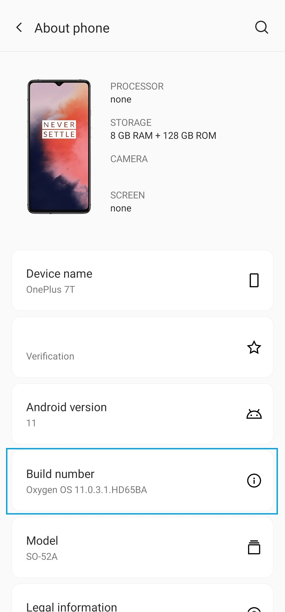
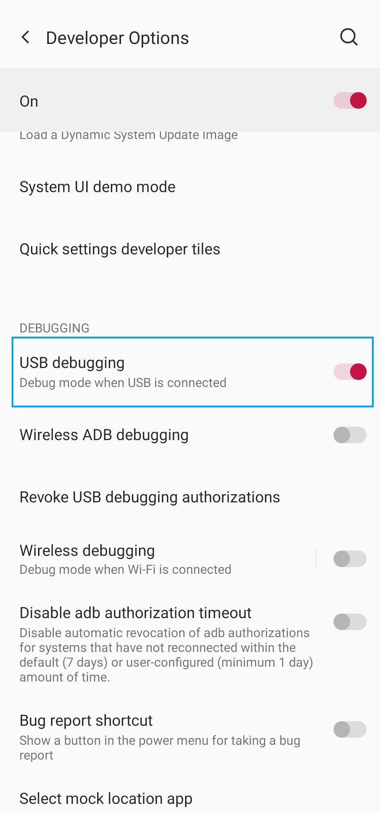
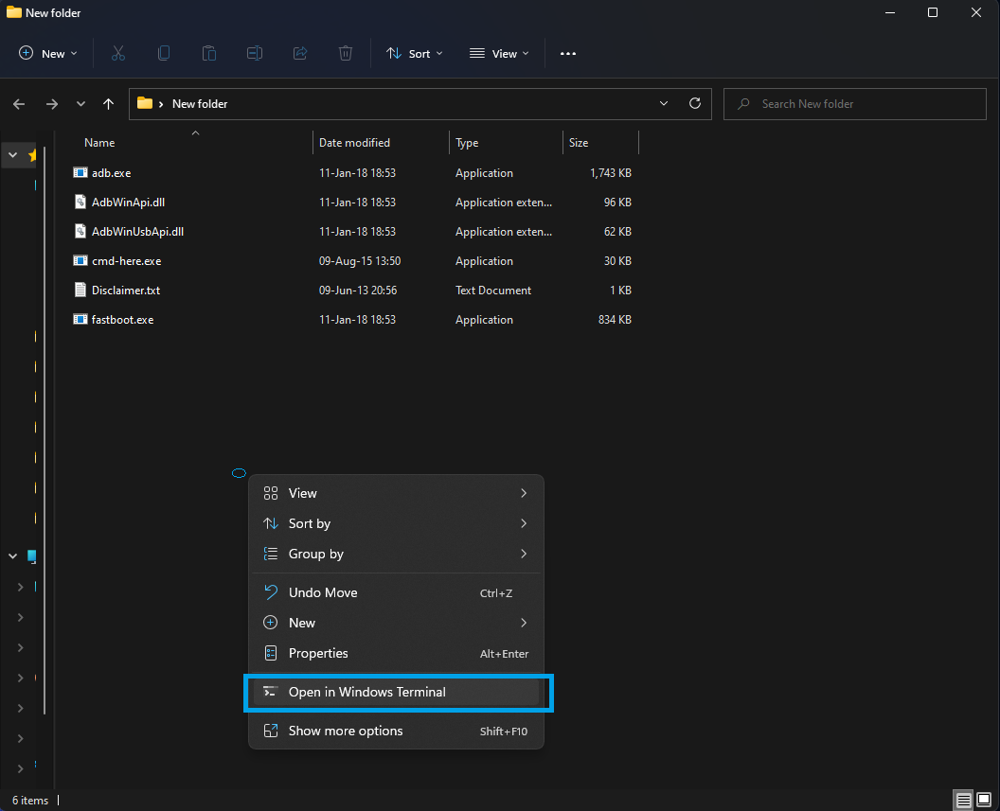
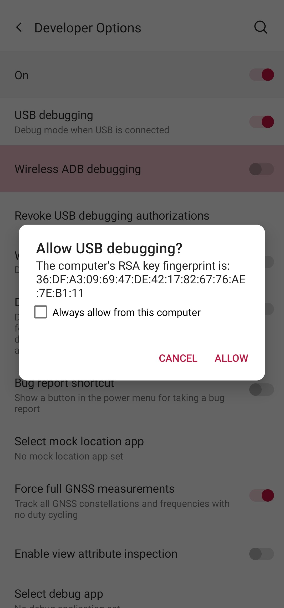
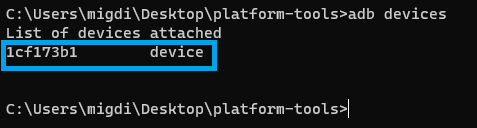

# SmartHertz Permissions

**YOU ONLY NEED TO DO THIS ON NON ROOTED OXYGEN OS OR SAMSUNG**

SmartHertz needs a permission in order to change the display refresh rate, this permission can't be given by the user like any other. Because of this the application can be granted the permission in two different ways, if you give superuser permissions to the application it will give the permissions itself, if you are not rooted, you need to grant the permissions using adb.

## Enable USB debugging in your device
First, open your phone settings android scroll to bottom, select **About phone**.
**Tap Build number** seven times to make developers options available.



Go back to settings and open **System -> Developer Options**



In the second section **Debugging** enable the first option **USB debugging**.

## Download ADB
Download adb from below:

* [Windows](https://dl.google.com/android/repository/platform-tools-latest-windows.zip)
* [Linux](https://dl.google.com/android/repository/platform-tools-latest-linux.zip)
* [MacOS](https://dl.google.com/android/repository/platform-tools-latest-darwin.zip)

## Unzip file
Unzip the file you just downloaded to a folder of your choice.

Now, open the folder. While holding Shift, right click anywhere in an empty space of the folder (not in a file). A menu will pop-up, select "open command window here", "Open in Windows Terminal" or "Open PowerShell window here" (depends on Windows version).



## Run command

**Connect the phone.** "USB debugging connected" notification should pop up.

### Start adb
**Run the command below:**
```
adb start-server
```

This should appear in the phone screen, **click on "ALLOW"**.



If it does not appear, disconnect the phone and connect again, also run the command again and make sure adb is running.

### Checking if device is listed

**Run:**
```
adb devices
```

Your device should be listed like in the image below.



### Grant permissions

Finally, **run the command below** to grant the permission to the application:
```
adb shell pm grant com.naprzod.smarthertz android.permission.WRITE_SECURE_SETTINGS
```

If there is any error, you can send me an email to mig.diluca@gmail.com
